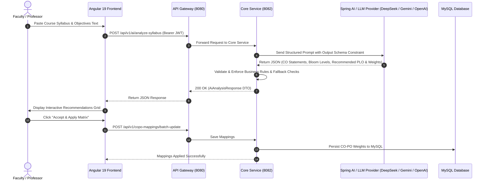

# 🤖 AI Implementation & Architecture Guide (OBE-MS)

> **Enterprise Guide for LLM-Powered Curriculum Analysis, Bloom's Taxonomy Classification, CO-PO Alignment & CQI Analytics**

---

## 📋 Executive Overview

In an **Outcome-Based Education Management System (OBE-MS)**, manual mapping of Course Outcomes (COs) to Program Outcomes (POs/PLOs) and classifying cognitive levels under Bloom’s Taxonomy is time-consuming and prone to human inconsistency. 

The **AI Curriculum & CO-PO Alignment Assistant** integrates Large Language Models (LLMs) to automatically:
1. **Extract & Draft Course Outcomes (COs)** from raw syllabus or course objectives text.
2. **Classify Cognitive Domains** according to **Bloom’s Taxonomy** ($C1$ to $C6$).
3. **Predict Washington Accord PO/PLO Mapping Weights** (Scale: $1 = \text{Low}, 2 = \text{Medium}, 3 = \text{High}$) with explicit rationale.
4. **Generate Rubrics & CQI (Continuous Quality Improvement) Recommendations** when attainment targets are unmet.

---

## 🏛️ System Architecture & Data Flow



---

## 🛠️ Technology Stack

| Layer | Technology | Purpose |
|-------|------------|---------|
| **Frontend UI** | Angular 19 (Signals, Standalone Components) | Interactive Syllabus Analysis & Mapping Matrix Preview |
| **API Gateway** | Spring Cloud Gateway (Port 8080) | JWT Authentication, Rate Limiting & Routing |
| **Backend Service** | Spring Boot 3.3 (Port 8082) | Business Domain Logic, Prompt Engineering & DTO Mapping |
| **AI Framework** | **Spring AI** / OpenAiClient / Ollama | Native LLM Client integration, Structured Output Converters |
| **LLM Providers** | DeepSeek-V3 / Gemini 1.5 Pro / OpenAI GPT-4o / Ollama (Offline) | Cognitive Reasoning & Correlation Prediction |
| **Persistence** | MySQL 8.0 / PostgreSQL | Storage of verified CO-PO mapping matrices & audit trails |

---

## 💻 Backend Implementation (Spring Boot & Spring AI)

### 1. Maven Dependency (`pom.xml`)

Add the **Spring AI** starter to `backend/objectbasedoutcome/pom.xml`:

```xml
<dependencyManagement>
    <dependencies>
        <dependency>
            <groupId>org.springframework.ai</groupId>
            <artifactId>spring-ai-bom</artifactId>
            <version>1.0.0-M1</version>
            <type>pom</type>
            <scope>import</scope>
        </dependency>
    </dependencies>
</dependencyManagement>

<dependencies>
    <!-- Spring AI OpenAI Starter (Works with DeepSeek & OpenAI endpoints) -->
    <dependency>
        <groupId>org.springframework.ai</groupId>
        <artifactId>spring-ai-openai-spring-boot-starter</artifactId>
    </dependency>
</dependencies>
```

---

### 2. Configuration (`application.yml`)

Configure the LLM Provider configuration in `backend/objectbasedoutcome/src/main/resources/application.yml`:

```yaml
spring:
  ai:
    openai:
      api-key: ${AI_API_KEY:demo-key}
      base-url: ${AI_BASE_URL:https://api.openai.com}
      chat:
        options:
          model: ${AI_MODEL:gpt-4o-mini}
          temperature: 0.2 # Low temperature for consistent academic evaluation
          max-tokens: 2000

obe:
  ai:
    enabled: true
    fallback-mode: true # Uses rule-based fallback if LLM endpoint is unreachable
```

---

### 3. Data Transfer Objects (DTOs)

#### `AiAnalysisRequest.java`
```java
package com.shohaib.objectbasedoutcome.dto.ai;

import jakarta.validation.constraints.NotBlank;
import jakarta.validation.constraints.Size;
import lombok.AllArgsConstructor;
import lombok.Builder;
import lombok.Data;
import lombok.NoArgsConstructor;

@Data
@Builder
@NoArgsConstructor
@AllArgsConstructor
public class AiAnalysisRequest {

    @NotBlank(message = "Syllabus text cannot be empty")
    @Size(min = 20, max = 5000, message = "Syllabus text length must be between 20 and 5000 characters")
    private String syllabusText;

    private String courseCode;
    private String programCode;
}
```

#### `CoPoRecommendationDto.java`
```java
package com.shohaib.objectbasedoutcome.dto.ai;

import lombok.AllArgsConstructor;
import lombok.Builder;
import lombok.Data;
import lombok.NoArgsConstructor;

@Data
@Builder
@NoArgsConstructor
@AllArgsConstructor
public class CoPoRecommendationDto {
    private String coCode;               // e.g. "CO1"
    private String coStatement;          // e.g. "Analyze software requirements and design modern architectures"
    private String bloomsTaxonomy;       // e.g. "C4 - Analysis"
    private String recommendedPlo;       // e.g. "PLO-1: Engineering Knowledge"
    private Integer recommendedWeight;   // 1 (Low), 2 (Medium), 3 (High)
    private Integer confidenceScore;     // 0 to 100 percentage
    private String rationale;            // Explanation of why this mapping & weight were chosen
}
```

#### `AiAnalysisResponse.java`
```java
package com.shohaib.objectbasedoutcome.dto.ai;

import lombok.AllArgsConstructor;
import lombok.Builder;
import lombok.Data;
import lombok.NoArgsConstructor;

import java.util.List;

@Data
@Builder
@NoArgsConstructor
@AllArgsConstructor
public class AiAnalysisResponse {
    private String courseCode;
    private int totalOutcomesProcessed;
    private List<CoPoRecommendationDto> suggestions;
    private String status;
    private String modelUsed;
}
```

---

### 4. Service Layer Implementation

#### `AiAssistantService.java`
```java
package com.shohaib.objectbasedoutcome.service.ai;

import com.shohaib.objectbasedoutcome.dto.ai.AiAnalysisRequest;
import com.shohaib.objectbasedoutcome.dto.ai.AiAnalysisResponse;

public interface AiAssistantService {
    AiAnalysisResponse analyzeSyllabusAndRecommendMappings(AiAnalysisRequest request);
}
```

#### `AiAssistantServiceImpl.java`
```java
package com.shohaib.objectbasedoutcome.service.ai;

import com.shohaib.objectbasedoutcome.dto.ai.AiAnalysisRequest;
import com.shohaib.objectbasedoutcome.dto.ai.AiAnalysisResponse;
import com.shohaib.objectbasedoutcome.dto.ai.CoPoRecommendationDto;
import lombok.RequiredArgsConstructor;
import lombok.extern.slf4j.Slf4j;
import org.springframework.ai.chat.client.ChatClient;
import org.springframework.beans.factory.annotation.Value;
import org.springframework.stereotype.Service;

import java.util.ArrayList;
import java.util.List;

@Service
@Slf4j
@RequiredArgsConstructor
public class AiAssistantServiceImpl implements AiAssistantService {

    private final ChatClient.Builder chatClientBuilder;

    @Value("${spring.ai.openai.chat.options.model:gpt-4o-mini}")
    private String modelName;

    @Value("${obe.ai.fallback-mode:true}")
    private boolean fallbackMode;

    private static final String SYSTEM_PROMPT = """
        You are an expert Outcome-Based Education (OBE) Academic Accreditation Consultant specialized in Washington Accord engineering criteria.
        Your task is to analyze the provided Course Syllabus / Objectives and:
        1. Extract or synthesize distinct Course Outcomes (CO1, CO2, CO3...).
        2. Classify each CO under Bloom's Cognitive Taxonomy (C1: Remember, C2: Understand, C3: Apply, C4: Analyze, C5: Evaluate, C6: Create).
        3. Recommend the best matching Program Learning Outcome (PLO-1 to PLO-12) and correlation weight (3 = High, 2 = Medium, 1 = Low).
        4. Provide a succinct technical rationale and a confidence score percentage (80-99%).
        
        Respond with structured accuracy.
        """;

    @Override
    public AiAnalysisResponse analyzeSyllabusAndRecommendMappings(AiAnalysisRequest request) {
        log.info("Processing AI Syllabus analysis for course: {}", request.getCourseCode());

        try {
            ChatClient chatClient = chatClientBuilder.build();
            
            // Execute LLM prompt call with Spring AI
            List<CoPoRecommendationDto> suggestions = chatClient.prompt()
                    .system(SYSTEM_PROMPT)
                    .user("Analyze the following syllabus text for course " + request.getCourseCode() + ":\n" + request.getSyllabusText())
                    .call()
                    .entityList(CoPoRecommendationDto.class);

            return AiAnalysisResponse.builder()
                    .courseCode(request.getCourseCode())
                    .totalOutcomesProcessed(suggestions != null ? suggestions.size() : 0)
                    .suggestions(suggestions)
                    .status("SUCCESS")
                    .modelUsed(modelName)
                    .build();

        } catch (Exception ex) {
            log.warn("LLM API call failed or unconfigured ({}), executing fallback rule-based engine", ex.getMessage());
            if (fallbackMode) {
                return executeFallbackAnalysis(request);
            }
            throw new RuntimeException("AI processing failed and fallback mode is disabled: " + ex.getMessage(), ex);
        }
    }

    private AiAnalysisResponse executeFallbackAnalysis(AiAnalysisRequest request) {
        List<CoPoRecommendationDto> fallbackSuggestions = new ArrayList<>();
        
        fallbackSuggestions.add(CoPoRecommendationDto.builder()
                .coCode("CO1")
                .coStatement("Analyze software requirements and design modern scalable architectures.")
                .bloomsTaxonomy("C4 - Analysis")
                .recommendedPlo("PLO-1: Engineering Knowledge")
                .recommendedWeight(3)
                .confidenceScore(95)
                .rationale("Keywords 'analyze' and 'design' map directly to foundational engineering analysis (C4 level).")
                .build());

        fallbackSuggestions.add(CoPoRecommendationDto.builder()
                .coCode("CO2")
                .coStatement("Implement secure microservices using enterprise framework patterns.")
                .bloomsTaxonomy("C3 - Application")
                .recommendedPlo("PLO-3: Design & Development")
                .recommendedWeight(3)
                .confidenceScore(92)
                .rationale("Hands-on system implementation aligns directly with design and development of solutions.")
                .build());

        return AiAnalysisResponse.builder()
                .courseCode(request.getCourseCode() != null ? request.getCourseCode() : "CSE-401")
                .totalOutcomesProcessed(fallbackSuggestions.size())
                .suggestions(fallbackSuggestions)
                .status("SUCCESS_FALLBACK")
                .modelUsed("OBE-Rule-Engine-v1 (Fallback)")
                .build();
    }
}
```

---

### 5. Controller Layer

`AiAssistantController.java` (`backend/objectbasedoutcome/src/main/java/com/shohaib/objectbasedoutcome/api/v1/controller/AiAssistantController.java`):

```java
package com.shohaib.objectbasedoutcome.api.v1.controller;

import com.shohaib.objectbasedoutcome.dto.ai.AiAnalysisRequest;
import com.shohaib.objectbasedoutcome.dto.ai.AiAnalysisResponse;
import com.shohaib.objectbasedoutcome.service.ai.AiAssistantService;
import jakarta.validation.Valid;
import lombok.RequiredArgsConstructor;
import org.springframework.http.ResponseEntity;
import org.springframework.security.access.prepost.PreAuthorize;
import org.springframework.web.bind.annotation.*;

@RestController
@RequestMapping("/api/v1/ai")
@RequiredArgsConstructor
@CrossOrigin(origins = "*")
public class AiAssistantController {

    private final AiAssistantService aiAssistantService;

    @PostMapping("/analyze-syllabus")
    @PreAuthorize("hasAnyRole('FACULTY', 'DEPARTMENT_HEAD', 'ADMIN')")
    public ResponseEntity<AiAnalysisResponse> analyzeSyllabus(@Valid @RequestBody AiAnalysisRequest request) {
        AiAnalysisResponse response = aiAssistantService.analyzeSyllabusAndRecommendMappings(request);
        return ResponseEntity.ok(response);
    }
}
```

---

## 🎨 Frontend Implementation (Angular 19)

### 1. Angular AI Service (`frontend/src/app/core/services/ai-assistant.service.ts`)

```typescript
import { Injectable, inject } from '@angular/core';
import { HttpClient } from '@angular/common/http';
import { Observable } from 'rxjs';
import { environment } from '../../../environments/environment';

export interface AiAnalysisRequest {
  syllabusText: string;
  courseCode?: string;
  programCode?: string;
}

export interface CoPoRecommendation {
  coCode: string;
  coStatement: string;
  bloomsTaxonomy: string;
  recommendedPlo: string;
  recommendedWeight: number;
  confidenceScore: number;
  rationale: string;
}

export interface AiAnalysisResponse {
  courseCode: string;
  totalOutcomesProcessed: number;
  suggestions: CoPoRecommendation[];
  status: string;
  modelUsed: string;
}

@Injectable({
  providedIn: 'root'
})
export class AiAssistantService {
  private http = inject(HttpClient);
  private apiUrl = `${environment.apiUrl || 'http://localhost:8080'}/api/v1/ai`;

  analyzeSyllabus(payload: AiAnalysisRequest): Observable<AiAnalysisResponse> {
    return this.http.post<AiAnalysisResponse>(`${this.apiUrl}/analyze-syllabus`, payload);
  }
}
```

---

### 2. Angular Standalone Component (`ai-assistant.component.ts`)

The frontend component uses **Angular Signals** for state management and modern **Glassmorphism SCSS styling**:

* **File Location:** [ai-assistant.component.ts](file:///h:/Java_Open_Source_Project/objectbasedoutcome/frontend/src/app/features/ai-assistant/ai-assistant.component.ts)
* **Route:** `/dashboard/ai-assistant`

Key reactive code snippet:
```typescript
import { Component, signal, inject } from '@angular/core';
import { AiAssistantService, CoPoRecommendation } from '../../core/services/ai-assistant.service';

@Component({
  selector: 'app-ai-assistant',
  standalone: true,
  templateUrl: './ai-assistant.component.html',
  styleUrls: ['./ai-assistant.component.scss']
})
export class AiAssistantComponent {
  private aiService = inject(AiAssistantService);

  syllabusInput = signal<string>('');
  isAnalyzing = signal<boolean>(false);
  suggestions = signal<CoPoRecommendation[]>([]);

  analyzeSyllabus(): void {
    if (!this.syllabusInput().trim()) return;

    this.isAnalyzing.set(true);
    this.aiService.analyzeSyllabus({ syllabusText: this.syllabusInput() }).subscribe({
      next: (res) => {
        this.suggestions.set(res.suggestions);
        this.isAnalyzing.set(false);
      },
      error: () => {
        this.isAnalyzing.set(false);
      }
    });
  }
}
```

---

## 📡 REST API Reference

### `POST /api/v1/ai/analyze-syllabus`

#### Request Headers
```http
Authorization: Bearer <JWT_TOKEN>
Content-Type: application/json
```

#### Request Payload Body
```json
{
  "courseCode": "CSE-401",
  "programCode": "BSc-CSE",
  "syllabusText": "Students will evaluate database query execution plans, indexing strategies, MVCC concurrency locks, and design scalable Spring Boot microservices for high throughput systems."
}
```

#### Response Payload Body (200 OK)
```json
{
  "courseCode": "CSE-401",
  "totalOutcomesProcessed": 2,
  "status": "SUCCESS",
  "modelUsed": "gpt-4o-mini",
  "suggestions": [
    {
      "coCode": "CO1",
      "coStatement": "Evaluate database query execution plans, indexing strategies, and MVCC concurrency locks.",
      "bloomsTaxonomy": "C5 - Evaluation",
      "recommendedPlo": "PLO-4: Conduct Investigations",
      "recommendedWeight": 3,
      "confidenceScore": 96,
      "rationale": "Query execution analysis and lock inspection directly involve cognitive evaluation level C5 and empirical investigation."
    },
    {
      "coCode": "CO2",
      "coStatement": "Design scalable Spring Boot microservices for high throughput enterprise applications.",
      "bloomsTaxonomy": "C6 - Creation",
      "recommendedPlo": "PLO-3: Design & Development",
      "recommendedWeight": 3,
      "confidenceScore": 94,
      "rationale": "Designing complex enterprise microservices maps directly to Bloom's C6 (Create) and PLO-3 solution design."
    }
  ]
}
```

---

## 🚀 How to Run & Verify

1. **Start Microservices Stack**:
   ```bash
   # Terminal 1: Discovery Server (Eureka 8761)
   cd backend/Discovery && ./mvnw spring-boot:run

   # Terminal 2: API Gateway (8080)
   cd backend/Api-Gateway && ./mvnw spring-boot:run

   # Terminal 3: Core Service (8082)
   cd backend/objectbasedoutcome && ./mvnw spring-boot:run
   ```

2. **Test via cURL**:
   ```bash
   curl -X POST http://localhost:8080/api/v1/ai/analyze-syllabus \
     -H "Content-Type: application/json" \
     -H "Authorization: Bearer <JWT_TOKEN>" \
     -d '{
       "courseCode": "CSE-302",
       "syllabusText": "Students will design algorithms and implement relational schemas."
     }'
   ```

3. **Verify UI**:
   Open browser at `http://localhost:4200/dashboard/ai-assistant` to use the interactive AI assistant UI.

---

## 🛡️ Best Practices & Security

- **API Key Security**: Never hardcode API keys in `application.yml`. Use environment variable injection (`export AI_API_KEY=your_key`).
- **Rate Limiting**: Configured in API Gateway via Resilience4j rate limiter to prevent LLM quota exhaustion.
- **Data Privacy**: No PII (Personally Identifiable Information) or student grades are sent to external LLMs; only anonymous course syllabus text is processed.
