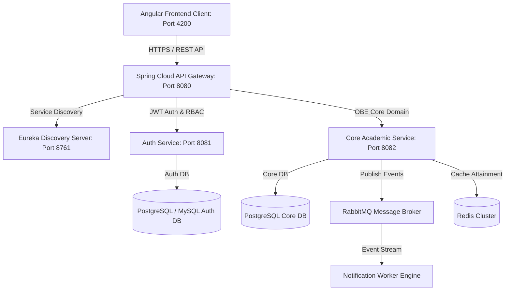
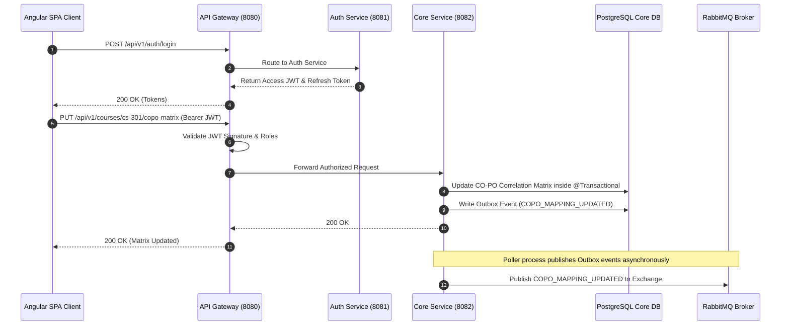

# Outcome-Based Education Management System (OBE-MS)
## System Architecture Blueprint

The Outcome-Based Education Management System (OBE-MS) is designed as a high-performance, modular service-oriented system consisting of modern Spring Boot backend microservices and an Angular Single Page Application client.

---

## 1. High-Level Microservices Topology

---

## 2. Request Processing Sequence Diagram

---

## 3. Backend Microservices Components

### 1. Discovery Server (`Discovery` - `:8761`)
- Dynamic service registry built with **Spring Cloud Netflix Eureka**.
- Allows microservices to dynamically register and discover each other without hardcoded IP addresses or ports.

### 2. API Gateway (`Api-Gateway` - `:8080`)
- Reactive API entry point built on **Spring Cloud Gateway** and **Project Reactor**.
- Responsibilities:
  - Global CORS management.
  - JWT Access Token verification and tenant context injection.
  - Dynamic route matching based on path prefixes (`/api/v1/auth/**` → Auth Service, `/api/v1/**` → Core Service).
  - Rate limiting with Redis sliding window.

### 3. OBE Auth Service (`objectbasedoutcome` - `:8081`)
- Handles identity management, user registration, JWT generation, password resets, and multi-tenant authorization.
- Flyway database migration scripts initialize security schemas.

### 4. Core OBE Service (`Core` - `:8082`)
- Manages key academic aggregates: Departments, Programs, Program Outcomes (POs), Courses, Course Outcomes (COs), CO-PO Mapping Matrix, Assessments, and Rubrics.
- Evaluates student outcome attainment using statistical aggregation engines.

---

## 4. Cross-Cutting Concerns

- **Resilience:** Circuit Breakers and Retry policies powered by Resilience4j prevent service cascade failures.
- **Security:** Standardized Spring Security 6 resource server configuration enforcing fine-grained RBAC permissions (`hasAuthority('ROLE_FACULTY')`).
- **Distributed Tracing:** Micrometer Tracing with OpenTelemetry context propagation across all HTTP and AMQP calls.
