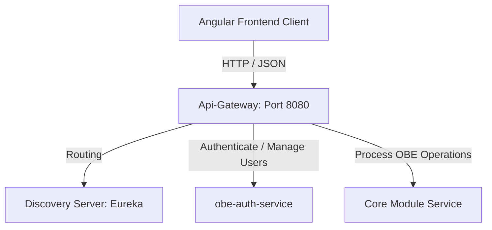

# OBE-MS System Architecture

The Outcome-Based Education Management System (OBE-MS) is designed as a modular, service-oriented system consisting of multiple Spring Boot backend services and a modern Angular frontend client.

## Backend Components

1. **Discovery Server (`Discovery`)**
   - Registry for service discovery.
   - Built with Spring Cloud Netflix Eureka.

2. **API Gateway (`Api-Gateway`)**
   - Single entry point for all frontend requests.
   - Handles path routing, proxying, and global load balancing.

3. **OBE Auth Service (`objectbasedoutcome`)**
   - Manages user identity, registration, token generation (JWT), email services, and password resets.
   - Database: MySQL database with Flyway schema migration.

4. **Core Service (`Core`)**
   - Contains core business logic, database entities, models, and shared utilities for the educational outcomes (courses, mapping, reports).

## Frontend Component

- **Angular 20 Client (`frontend`)**
   - A single-page application (SPA) designed with Standalone Components and Angular Signals for high-performance reactive state management.
