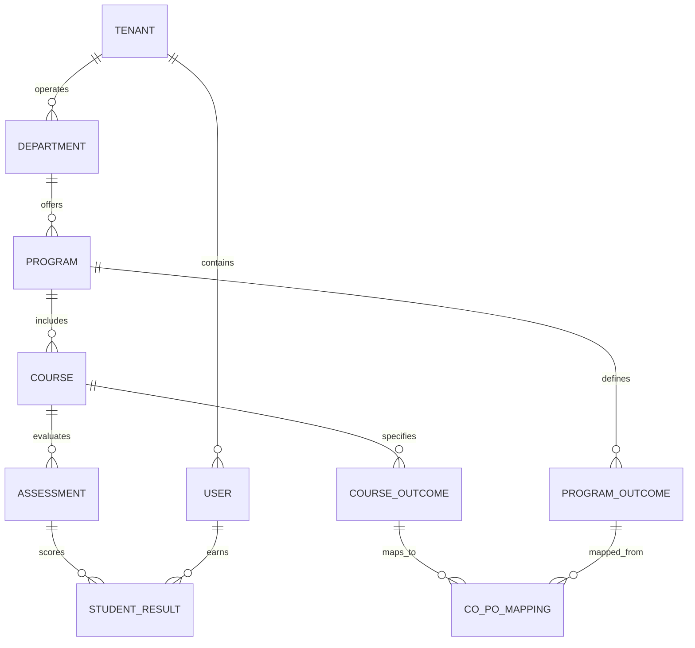

# Outcome-Based Education Management System (OBE-MS)
## Enterprise Database Schema & Storage Blueprint

> **Supported Relational Databases:** PostgreSQL 16+ / MySQL 8.0+  
> **Schema Migration Tool:** Flyway / Liquibase  
> **Multi-Tenancy Strategy:** Shared Database with Tenant ID Discriminator Column (`tenant_id`)  
> **Data Integrity:** Strict Foreign Key constraints, Unique Indexes, and Pessimistic/Optimistic locking.

---

## 1. Entity Relationship Overview



---

## 2. Authentication & Identity Schema (`auth_db`)

### 2.1 `users`
Stores user credential & profile information across all institutional tenants.

| Column | Type | Constraints | Description |
| :--- | :--- | :--- | :--- |
| `id` | `VARCHAR(36)` | `PRIMARY KEY` | UUID v4 user identifier |
| `tenant_id` | `VARCHAR(64)` | `NOT NULL, INDEX` | Institutional tenant ID |
| `email` | `VARCHAR(128)` | `NOT NULL, UNIQUE` | User email / login username |
| `password_hash` | `VARCHAR(255)` | `NOT NULL` | BCrypt/Argon2 password hash |
| `full_name` | `VARCHAR(100)` | `NOT NULL` | Display name |
| `role` | `VARCHAR(32)` | `NOT NULL` | Enum (`ADMIN`, `DEAN`, `HOD`, `FACULTY`, `STUDENT`) |
| `is_active` | `BOOLEAN` | `DEFAULT TRUE` | Account status flag |
| `created_at` | `TIMESTAMP` | `DEFAULT CURRENT_TIMESTAMP` | Account creation timestamp |
| `version` | `BIGINT` | `DEFAULT 0` | Optimistic locking version |

### 2.2 `refresh_tokens`
Stores active refresh tokens issued to clients.

| Column | Type | Constraints | Description |
| :--- | :--- | :--- | :--- |
| `id` | `VARCHAR(36)` | `PRIMARY KEY` | UUID token identifier |
| `user_id` | `VARCHAR(36)` | `FK -> users(id)` | User reference |
| `token_hash` | `VARCHAR(255)` | `NOT NULL, UNIQUE` | Cryptographic hash of token |
| `expires_at` | `TIMESTAMP` | `NOT NULL, INDEX` | Expiry timestamp |
| `revoked` | `BOOLEAN` | `DEFAULT FALSE` | Revocation status |

---

## 3. Core Academic & OBE Schema (`core_db`)

### 3.1 `program_outcomes` (POs / PLOs)
High-level outcomes expected of graduates from a program.

```sql
CREATE TABLE program_outcomes (
    id VARCHAR(36) PRIMARY KEY,
    tenant_id VARCHAR(64) NOT NULL,
    program_id VARCHAR(36) NOT NULL,
    code VARCHAR(16) NOT NULL,
    title VARCHAR(255) NOT NULL,
    description TEXT NOT NULL,
    taxonomy_domain VARCHAR(32) NOT NULL DEFAULT 'COGNITIVE',
    target_attainment DECIMAL(5,2) DEFAULT 70.00,
    created_at TIMESTAMP DEFAULT CURRENT_TIMESTAMP,
    CONSTRAINT uk_program_po_code UNIQUE (program_id, code)
);
CREATE INDEX idx_po_tenant_prog ON program_outcomes(tenant_id, program_id);
```

### 3.2 `course_outcomes` (COs / CLOs)
Specific competencies achieved upon completing a course.

```sql
CREATE TABLE course_outcomes (
    id VARCHAR(36) PRIMARY KEY,
    tenant_id VARCHAR(64) NOT NULL,
    course_id VARCHAR(36) NOT NULL,
    code VARCHAR(16) NOT NULL,
    description TEXT NOT NULL,
    blooms_level VARCHAR(32) NOT NULL,
    weight DECIMAL(5,2) DEFAULT 25.00,
    CONSTRAINT uk_course_co_code UNIQUE (course_id, code)
);
CREATE INDEX idx_co_course ON course_outcomes(course_id);
```

### 3.3 `co_po_mapping`
Correlation matrix mapping Course Outcomes to Program Outcomes with numeric weights (3=High, 2=Medium, 1=Low).

```sql
CREATE TABLE co_po_mapping (
    id VARCHAR(36) PRIMARY KEY,
    co_id VARCHAR(36) NOT NULL REFERENCES course_outcomes(id) ON DELETE CASCADE,
    po_id VARCHAR(36) NOT NULL REFERENCES program_outcomes(id) ON DELETE CASCADE,
    correlation_weight INT CHECK (correlation_weight IN (1, 2, 3)),
    created_at TIMESTAMP DEFAULT CURRENT_TIMESTAMP,
    CONSTRAINT uk_co_po UNIQUE (co_id, po_id)
);
CREATE INDEX idx_copo_po ON co_po_mapping(po_id);
```

### 3.4 `assessments`
Exams, projects, quizzes, and homework items evaluating specific COs. Dynamic rubrics are persisted in PostgreSQL `JSONB` format (or MySQL `JSON`).

```sql
CREATE TABLE assessments (
    id VARCHAR(36) PRIMARY KEY,
    tenant_id VARCHAR(64) NOT NULL,
    course_id VARCHAR(36) NOT NULL,
    title VARCHAR(128) NOT NULL,
    assessment_type VARCHAR(32) NOT NULL,
    total_marks DECIMAL(6,2) NOT NULL,
    weightage DECIMAL(5,2) NOT NULL,
    rubric_definition JSONB DEFAULT NULL,
    created_at TIMESTAMP DEFAULT CURRENT_TIMESTAMP
);
CREATE INDEX idx_assessment_course ON assessments(course_id);
CREATE INDEX idx_assessment_rubric ON assessments USING GIN (rubric_definition);
```

### 3.5 `student_results`
Individual student scores recorded per assessment item. Partitioned by `academic_year` for massive scaling.

```sql
CREATE TABLE student_results (
    id VARCHAR(36) NOT NULL,
    tenant_id VARCHAR(64) NOT NULL,
    assessment_id VARCHAR(36) NOT NULL REFERENCES assessments(id),
    student_id VARCHAR(36) NOT NULL,
    academic_year INT NOT NULL,
    marks_obtained DECIMAL(6,2) NOT NULL,
    graded_at TIMESTAMP DEFAULT CURRENT_TIMESTAMP,
    PRIMARY KEY (id, academic_year)
) PARTITION BY RANGE (academic_year);

-- Partition Tables for Scalability
CREATE TABLE student_results_2025 PARTITION OF student_results
    FOR VALUES FROM (2025) TO (2026);
CREATE TABLE student_results_2026 PARTITION OF student_results
    FOR VALUES FROM (2026) TO (2027);
```

---

## 4. Transactional Outbox Pattern Schema

Guarantees atomic DB state changes and event publishing to RabbitMQ/Kafka.

```sql
CREATE TABLE outbox_events (
    id VARCHAR(36) PRIMARY KEY,
    aggregate_type VARCHAR(64) NOT NULL,
    aggregate_id VARCHAR(36) NOT NULL,
    event_type VARCHAR(64) NOT NULL,
    payload JSONB NOT NULL,
    status VARCHAR(16) NOT NULL DEFAULT 'PENDING',
    created_at TIMESTAMP DEFAULT CURRENT_TIMESTAMP
);
CREATE INDEX idx_outbox_status_created ON outbox_events(status, created_at);
```

---

## 5. Indexing & Query Performance Principles

1. **Composite Indexes:** Always index multi-tenant queries on `(tenant_id, foreign_key_id)`.
2. **JSONB GIN Indexes:** Enable fast querying within dynamic assessment rubric criteria structure (`WHERE rubric_definition @> '{"criteria": [...]}';`).
3. **Partitioning:** Range partitioning on `student_results` prevents index bloat on historic academic records.
